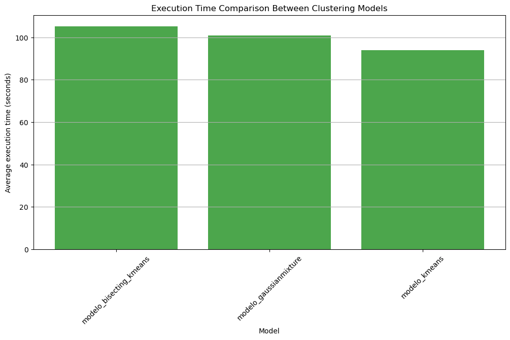
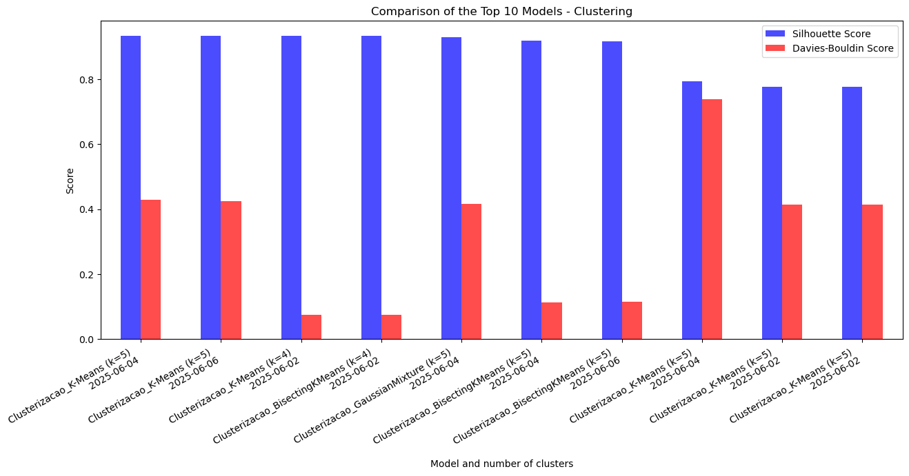

# Clusterization Analysis

This project presents a comparative analysis of clustering models using PySpark within Microsoft Fabric. The goal is to identify the most effective algorithm by evaluating cluster quality and computational efficiency.

## 🔍 Overview
We tested and compared three clustering models:
- K-Means
- Bisecting K-Means
- Gaussian Mixture

## 📊 Evaluation Metrics
- **Silhouette Score**: Higher values indicate better cluster separation.
- **Davies-Bouldin Score**: Lower values indicate more compact and distinct clusters.
- **Execution Time**: Assessed to understand the computational cost of each model.

## 🧠 Key Insights
- K-Means with k=4 showed the best performance in terms of Silhouette Score.
- Bisecting K-Means demonstrated consistent improvement and stability.
- Gaussian Mixture struggled with cluster separation and had a negative Davies-Bouldin peak.
- Models with better scores often required longer execution times.

## 🛠️ Tools & Platform
- **PySpark** for scalable clustering
- **Microsoft Fabric** for orchestration and data processing
- **Matplotlib & Seaborn** for visual analysis

## 📌 Project Highlights
- Over 100 model executions analyzed
- Visual comparisons of clustering metrics over time
- Trade-off analysis between accuracy and efficiency

## 📷 Visuals  
## 📊 Model Comparison

### 📊 Bar Chart – Execution Time by Model  
This chart illustrates the average execution time for each clustering model, helping to visualize the computational cost associated with each approach.  

### 📈 Line Chart – Metrics Evolution Over Time  
This chart displays the evolution of clustering metrics (Silhouette Score and Davies-Bouldin Index) over time, allowing us to observe how each model improved or stabilized across multiple executions.  

### 📊 Bar Chart – Top 10 Models by Quality  
This chart highlights the top 10 clustering models ranked by Silhouette Score, with corresponding Davies-Bouldin values. It provides a direct comparison of clustering quality across the best-performing configurations.  

## 📁 Repository Structure
- `notebooks/`: Jupyter notebooks with code and analysis
- `img/`: Visuals used in the documentation
- `README.md`: Project summary and insights
- `README.pt-br.md` Projet summary and Insights in Brasilian Portuguese

## 📬 Author
Renata Thomazelli  
Python Developer | Data Analyst | Machine Learning Enthusiast  
[Portfolio Website](https://renata-thomazelli.github.io/portfolio/)  

