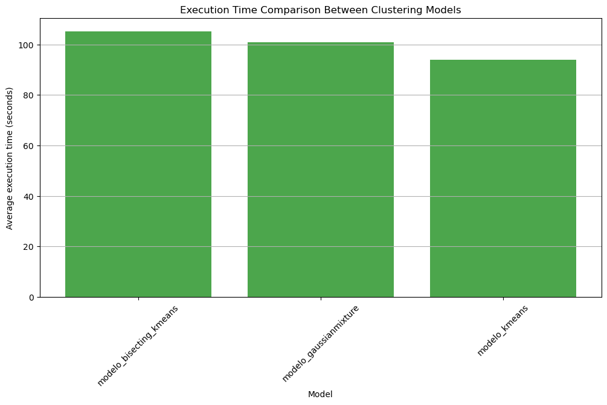
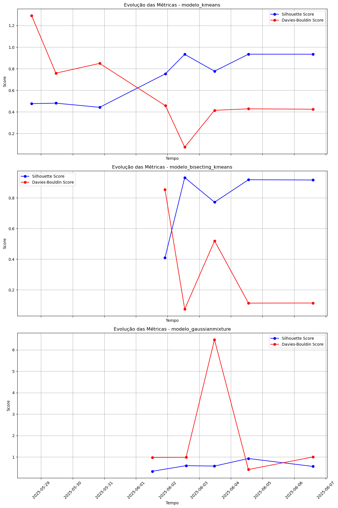
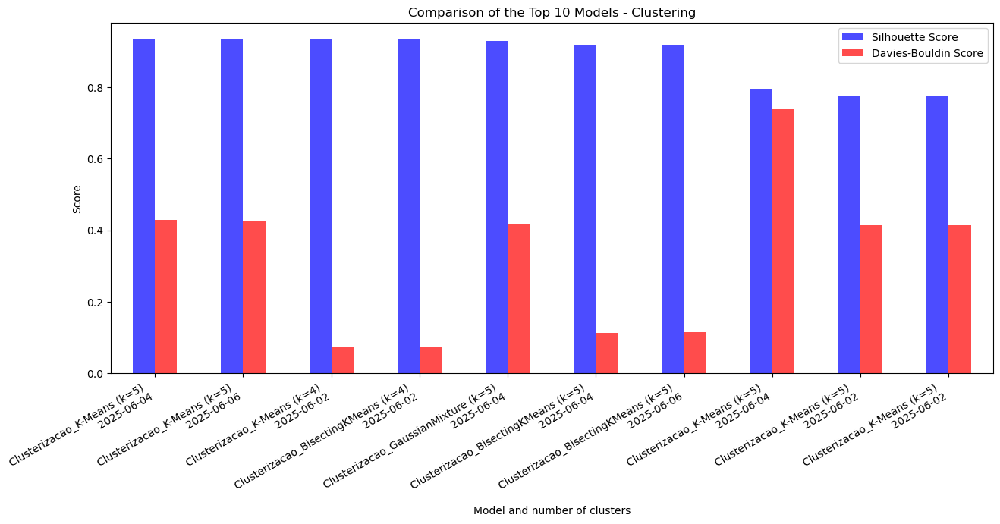

# 📊 ClusterizationAnalysis

Este projeto apresenta uma análise comparativa de modelos de clusterização utilizando **PySpark** dentro da plataforma **Microsoft Fabric**. O objetivo é identificar o algoritmo mais eficaz, avaliando tanto a **qualidade dos agrupamentos** quanto a **eficiência computacional**.

---

## 🔍 Visão Geral

Testamos e comparamos três modelos de clusterização amplamente utilizados:

- **K-Means**
- **Bisecting K-Means**
- **Gaussian Mixture**

---

## 📊 Métricas de Avaliação

Utilizamos três métricas principais para avaliar os modelos:

- **Silhouette Score**  
  Quanto maior o valor, melhor a separação entre os clusters.

- **Davies-Bouldin Score**  
  Quanto menor o valor, mais compactos e distintos são os grupos.

- **Tempo de Execução**  
  Avaliado para entender o custo computacional de cada modelo.

---

## 🧠 Principais Insights

- O modelo **K-Means com k=4** apresentou o melhor desempenho em termos de Silhouette Score.
- O **Bisecting K-Means** demonstrou evolução consistente e estabilidade nas métricas.
- O **Gaussian Mixture** teve dificuldades na separação dos clusters e apresentou um pico negativo no Davies-Bouldin Score.
- Os modelos com melhores métricas geralmente exigiram **mais tempo de execução**, evidenciando um trade-off entre precisão e desempenho.

---

## 🛠️ Ferramentas e Plataforma

- **PySpark** para processamento escalável
- **Microsoft Fabric** para orquestração e análise de dados
- **Matplotlib** e **Seaborn** para visualizações gráficas

---

## 📌 Destaques do Projeto

- Mais de **100 execuções de modelos analisadas**
- Comparações visuais das métricas ao longo do tempo
- Análise dos trade-offs entre **qualidade dos clusters e custo computacional**
- Todo o trabalho foi executado dentro da plataforma **Microsoft Fabric**, destacando o uso de tecnologias modernas e escaláveis.

---

## 📷 Visuais
## 📊 Comparação de Modelos

### 📊 Gráfico de Barras – Tempo de Execução por Modelo
Este gráfico ilustra o tempo médio de execução para cada modelo de agrupamento, ajudando a visualizar o custo computacional associado a cada abordagem.

### 📈 Gráfico de Linhas – Evolução das Métricas ao Longo do Tempo
Este gráfico exibe a evolução das métricas de agrupamento (Silhouette Score e Davies-Bouldin Index) ao longo do tempo, permitindo-nos observar como cada modelo melhorou ou se estabilizou em múltiplas execuções.

### 📊 Gráfico de Barras – 10 Melhores Modelos por Qualidade
Este gráfico destaca os 10 melhores modelos de clustering classificados pela Pontuação Silhouette, com os valores Davies-Bouldin correspondentes. Ele fornece uma comparação direta da qualidade do clustering entre as configurações de melhor desempenho.

---

## 📁 Estrutura do Repositório
- `notebook/` Jupyter notebook com o código e análise
- `img/` : Charts com as análises
- `README.md`Sumário do Projeto e insights em inglês
- `README.pt-br.md`Sumário do Projeto e insights em português brasileiro

---

## 📬 Autora

**Renata Thomazelli**  
Desenvolvedora Python | Analista de Dados | Entusiasta de Machine Learning  
🌐 [Site Portfólio](https://renata-thomazelli.github.io)  

---

